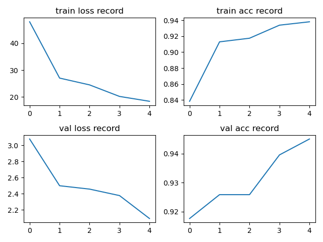

# ResNet

## Conclusion

模型没有给指定 ResNet 版本的参数，代码使用的是 ResNet34

新增的命令行参数：
 
 - --linear_eval：使用线性评估，需要导入预训练 pth 文件
 - --pretrained_path <path>：pth 预训练文件路径

使用 pretrained 的模型效果会很好，如果导入除 fc 层外（fc层输出维度不同）的参数再训练，第一个 epoch validation acc 基本就可以接近 90

使用预训练的 pth 文件，lr=0.0001，batch_size=32，训练 5 个 epoch 的结果：

最后一个 epoch 的结果：train loss:18.3951, train acc:0.9380 | val loss:2.0924 val acc:0.9451

---

下面的总结不把 conv1.x 后的 maxpool 考虑在 conv2.x 中

ResNet18 / 34  中：

- conv2.x 中所有 block 都不改变 channel 和 HxW，实线的残差操作
- conv3.x / 4.x / 5.x 中 只有第一个 block 改变 channel 和大小（虚线残差），后面的 block in_channel = out_channel，且所有 stride 为 1（实线残差）

ResNet50 / 101 / 152  中：

- conv2.x 中 不改变 HxW，第一个 block 输出 channel 为 256，后面的 block in_channel=out_channel=256
- conv3.x / 4.x / 5.x 中 只有第一个 block 改变 channel 和大小（虚线残差），后面的 block in_channel = out_channel，且所有 stride 为 1（实线残差）

## Model

ResNet：

ResNet34：

ResNeXt Block：

ResNeXt-50（32 x 4d）：

