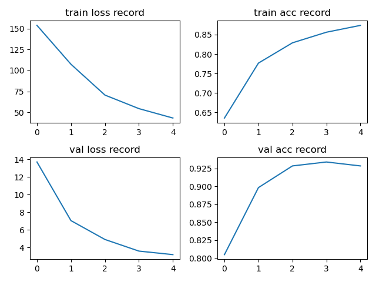

# ShuffleNet

## Conclusion

使用预训练的 v2 1x 的 pth 文件，lr=0.0001，batch_size=32，训练 5 个 epoch 的结果：

## Model

### ShuffleNet(v1)

ChannelShuffle:

针对普通 GConv 不同组之间没有信息交流提出了 Channel Shuffle

ShuffleNet(v1) Unit: 

ShuffleNet Unit 全是 GConv 和 DWConv

ResNeXt 作者指出 pw conv 占据的计算量非常多，所以 group conv 的计算量其实不大；于是 ShuffleNet(v1) 中把 PW conv 全部换成了 1x1 GConv

ShuffleNet(v1) architecture: 

注意 stage2 不使用 GConv 在第一个 1x1 conv，因为维度太小了

### ShuffleNet(v2)

作者提出计算复杂度不能只看 FLOPs（比如MAC(memory access cost)，平台），并提出 4 条高效网络准则（在 FLOPs 不变的情况下）：

-   G1: Equal channel width minimizes memory access cost (MAC). 卷积层的 in_channel = out_channel 时 MAC 最小
-   G2: Excessive group convolution increases MAC. GConv 中 groups 增大时 MAC 也会增大（因为 FLOPs 不变，所以 groups 增大时 out_channel 增大）
-   G3: Network fragmentation reduces degree of parallelism. 网络碎片化（分支结构）越多，速度越慢，如 GoogLeNet
-   G4: Element-wise operations are non-negligible.  Element-wise 操作的影响不可忽视，如 ReLU，AddTensor，AddBias

Basic Unit in ShuffleNet(v2):

-   (c)：如果 stride = 1（HxW 不变，不下采样），将 channel 分为两半，一个分支不做操作，最后 concat
-   (d)：如果 stride = 2（HxW 改变，下采样），不做 Channel Spilt，两个分支的 channel 和 in_channel 一致， concat 后 channel 翻倍
-   最后的 ReLU 前移到右边的分支，减少了 Element-wise operations
-   Also, the three successive elementwise operations, “Concat”, “Channel Shuffle” and “Channel Split”, are merged into a single element-wise operation. These changes are beneficial according to G4.（不是很理解）

ShuffleNet(v2) architecture: 

