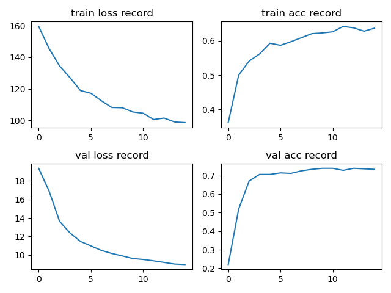

# EfficientNet

## Conclusion

pth 文件 pytorch 官方并没有给，[大佬](https://github.com/WZMIAOMIAO/deep-learning-for-image-processing)有给从 tensorflow 那边转过来的，[这里](https://github.com/WZMIAOMIAO/deep-learning-for-image-processing/blob/master/pytorch_classification/Test9_efficientNet/train.py)

使用预训练的 B0 的 pth 文件，lr=0.0001，batch_size=32，训练 15 个 epoch 的结果(我这里训练 15 个epoch 都不及之前训练 5 个，不知道是不是我的 model 有错误)：

## Model

EfficientNet 十分占显存  

https://blog.csdn.net/qq_37541097/article/details/114434046

网络宽度，深度，图像分辨率

MBConv1 的 1 表示 Mobile Block 的倍率因子；1 时 block 不需要第一个 1x1 conv 去升维

shortcut 操作只有输出 CxHxW 和 输入 CxHxW 完全一样才有

SE 模块第一个 fc 层的节点个数是 **MBConv** in_channel 的 1/4，而不是此 fc 层 in_channel 的 1/4

