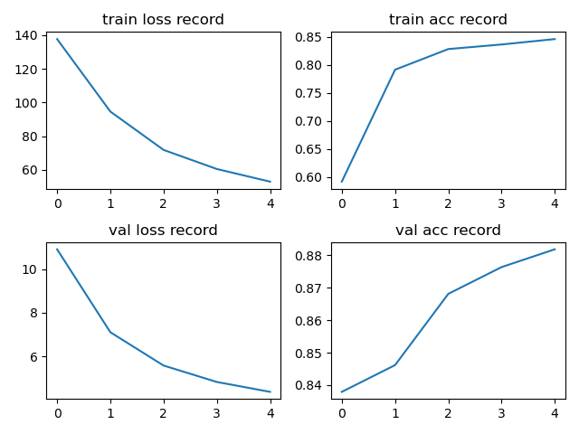
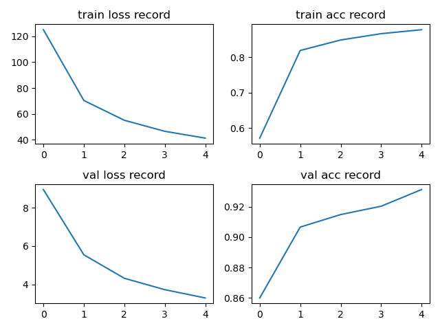

# EfficientNet

## Conclusion

### v1

pth 文件 pytorch 官方并没有给，[大佬](https://github.com/WZMIAOMIAO/deep-learning-for-image-processing)有给从 tensorflow 那边转过来的，[这里](https://github.com/WZMIAOMIAO/deep-learning-for-image-processing/blob/master/pytorch_classification/Test9_efficientNet/train.py)

使用预训练的 B0 的 pth 文件，lr=0.0001，batch_size=32，训练 5 个 epoch 的结果：



### v2

[权重文件来源](https://github.com/WZMIAOMIAO/deep-learning-for-image-processing/tree/master/pytorch_classification/Test11_efficientnetV2)

使用预训练的 s 的 pth 文件，lr=0.0001，batch_size=32，训练 5 个 epoch 的结果：




## Model

EfficientNet 中的 InvertedResidual 模块中在主分支的最后会有 Dropout 层，且 Dropout 为 [Stochastic Depth](https://arxiv.org/pdf/1603.09382.pdf)，这里随机丢弃的是 Residual 中的主分支，即只要 shortcut 部分，相当于随机减小了模型深度

### v1

https://blog.csdn.net/qq_37541097/article/details/114434046

EfficientNet 十分占显存  

作者探索了网络宽度，深度，图像分辨率三者对网络性能的影响


MBConv1 的 1 表示 Mobile Block 的倍率因子；为 1 时 block 不需要第一个 1x1 conv 去升维

shortcut 操作只有输出 CxHxW 和 输入 CxHxW 完全一样才有

SE 模块第一个 fc 层的节点个数是 **MBConv** in_channel 的 1/4，而不是此 fc 层 in_channel 的 1/4

MBConv1(v1) architecture:


### v2

https://blog.csdn.net/qq_37541097/article/details/116933569

v1 中存在的问题

-   图像尺寸很大时，训练很慢
-   网络浅层中使用 DW Conv 速度很慢
-   同等的放大每个 stage 是次优的 

v2 的改动与贡献：

-   Fused-MBConv:

    如果 expansion_ratio 为 1 没有第一个 1x1 Conv；只有 channel 和 HxW 相同才有 shortcut；如果有 shortcut 会在 shortcut 前加上 dropout


-   采用非均匀的缩放策略（不同等的放大每个 stage）
-   提出了改进的渐进学习方法（progressive training setting），根据训练图像尺寸动态调节正则方法（Dropout，RandAugment， Mixup）；图像尺寸变大时上面三项需要变强
-   使用较小的 expansion_ratio 和 小的 kernel_size（3x3）
-   V2-S 移除了 v1 中的 stage8

MBConv1(v2)-S architecture: M 和 L 比 S 多一个 stage


## Stochastic Depth

EfficientNet 中的 InvertedResidual 模块中在主分支的最后会有 Dropout 层，且 Dropout 为 [Stochastic Depth](https://arxiv.org/pdf/1603.09382.pdf)，这里随机丢弃的是 Residual 中的主分支，即只要 shortcut 部分，相当于随机减小了模型深度

代码：

```python
def drop_path(x, drop_prob: float = 0., training: bool = False): 
    """
    Drop paths (Stochastic Depth) per sample (when applied in main path of residual blocks).
    "Deep Networks with Stochastic Depth", https://arxiv.org/pdf/1603.09382.pdf
    This function is taken from the rwightman.
    It can be seen here:
    https://github.com/rwightman/pytorch-image-models/blob/master/timm/models/layers/drop.py#L140
    """
    if drop_prob == 0. or not training:
        return x
    keep_prob = 1 - drop_prob
    shape = (x.shape[0],) + (1,) * (x.ndim - 1)  # work with diff dim tensors, not just 2D ConvNets
    random_tensor = keep_prob + torch.rand(shape, dtype=x.dtype, device=x.device)
    random_tensor.floor_()  # binarize
    # 以 图像为例，shape 为 (batch_size, 1, 1, 1)，可以对每张图片经过的 residual 模块中的主分支舍弃
    output = x.div(keep_prob) * random_tensor
    return output

class DropPath(nn.Module):
    """
    Drop paths (Stochastic Depth) per sample  (when applied in main path of residual blocks).
    "Deep Networks with Stochastic Depth", https://arxiv.org/pdf/1603.09382.pdf
    """
    def __init__(self, drop_prob=None):
        super(DropPath, self).__init__()
        self.drop_prob = drop_prob

    def forward(self, x):
        return drop_path(x, self.drop_prob, self.training)
```


 
