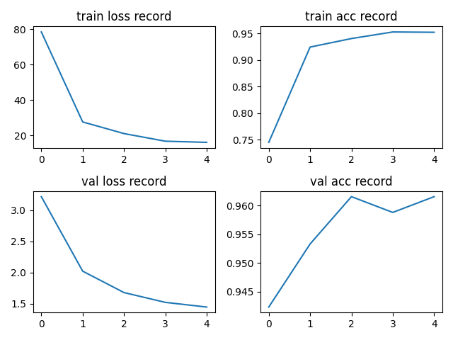

# Vit

源码来自 rwightman，我在 WZMIAOMIAO 注释的基础上加了自己的注释

## Conclusion

使用预训练的 Vit-B 的 pth 文件，lr=0.0001，batch_size=32，训练 5 个 epoch 的结果：

## Model

参考：https://blog.csdn.net/qq_37541097/article/details/118242600

以 ViT-B/16为例

模型由三个模块组成：

-   Linear Projection of Flattened Patches
-   Transformer Encoder
-   MLP Head

### Linear Projection of Flattened Patches

可以通过一个卷积层实现，把一个三维数据展平成二维输入 Transformer Encoder；例如 [224, 224, 3] -> [14, 14, 768] -> [196, 768]

在输入 Transformer Encoder 需要加上 [class] token （用于分类）和 position embedding（表示位置信息）

### Transformer Encoder

重复堆叠 Encoder Block L 次

在 MLP Block 中第一个 Linear 会把输入节点翻4倍`[197, 768] -> [197, 3072]`，第二个全连接层会还原回原节点个数`[197, 3072] -> [197, 768]` 

通过 Encoder 后 输入和输出 shape 保持不变

### MLP Head

MLP Head 原论文中说在训练 ImageNet21K 时是由`Linear`+`tanh激活函数`+`Linear`组成，但是迁移到 ImageNet1K 上或者你自己的数据上时，只用一个`Linear`即可

### 完整流程

