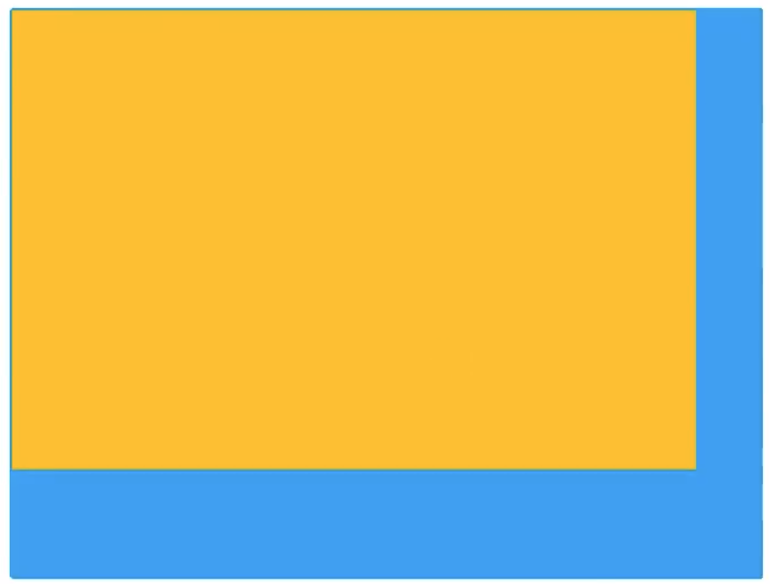

# Faster RCNN

代码来源：[WZMIAOMIAO](https://github.com/WZMIAOMIAO/deep-learning-for-image-processing/tree/master/pytorch_object_detection/faster_rcnn)

mobilenetv3 large 作为 backbone 在 pascal voc 上训练 10 个 epoch（效果挺差的，用了 colab 跑了好几个小时）

```
IoU metric: bbox
 Average Precision  (AP) @[ IoU=0.50:0.95 | area=   all | maxDets=100 ] = 0.179
 Average Precision  (AP) @[ IoU=0.50      | area=   all | maxDets=100 ] = 0.431
 Average Precision  (AP) @[ IoU=0.75      | area=   all | maxDets=100 ] = 0.106
 Average Precision  (AP) @[ IoU=0.50:0.95 | area= small | maxDets=100 ] = 0.077
 Average Precision  (AP) @[ IoU=0.50:0.95 | area=medium | maxDets=100 ] = 0.141
 Average Precision  (AP) @[ IoU=0.50:0.95 | area= large | maxDets=100 ] = 0.197
 Average Recall     (AR) @[ IoU=0.50:0.95 | area=   all | maxDets=  1 ] = 0.235
 Average Recall     (AR) @[ IoU=0.50:0.95 | area=   all | maxDets= 10 ] = 0.409
 Average Recall     (AR) @[ IoU=0.50:0.95 | area=   all | maxDets=100 ] = 0.430
 Average Recall     (AR) @[ IoU=0.50:0.95 | area= small | maxDets=100 ] = 0.201
 Average Recall     (AR) @[ IoU=0.50:0.95 | area=medium | maxDets=100 ] = 0.338
 Average Recall     (AR) @[ IoU=0.50:0.95 | area= large | maxDets=100 ] = 0.465
```

## 模型结构图

黄色线是只有在训练时才会有的步骤


## Model

### GeneralizedRCNNTransform

-   Normalize
-   Resize，这里的每张图片的尺寸都是不一样的，所以这里把每个 Batch 的图片的长宽都 Resize 到同一个范围内，Resize 的方法采用双线性插值
-   batch images，把 Resize 后的图片全都打包到同样的维度，方法是选取一个 Batch 中所有图片最大的长和宽，然后在图片的右边和下面补 0，补到最大的长和宽；如下图




### Backbone

特征提取部分, 可以使用不同的 classification 网络，选取不同层的输出作为 feature map

也可以选择是否使用 FPN 对输出的不同层次的 feature map 进行融合，得到新的 feature map


### RPN

-   AnchorGenerator:：锚框生成器，形成不同尺度，不同长宽比的 proposal anchor
-   RPN Head：对 backbone 得到的特征图上的每一个像素都进行对 anchor 类别的预测和 anchor 回归参数的预测；这里的 feature map 的每一个像素是等比例映射到原图上作为 anchor 的中心点
-   随机取样 proposal anchor 计算 Loss，类别 Loss 正样本和负样本都计算，回归参数 Loss 只计算正样本的


### ROI

-   ROIPooling：现在一般使用 ROIAlign，ROIPooling 进行的 2 次取整，对精度损失较大；在得到的 proposal anchor 上映射到 feature map 上，然后转化为同样的维度的特征图，方便后面的处理
-   Two MLPHead：2 个 fc 层
-   Faster RCNNPredictor：计算选中区域的 logits 和 回归参数
-   PostPrecessing：后处理

## 代码结构

my_dataset.py: 定义的 PASCAL VOC 的数据集

transforms.py: 对 transformer 的重写，因为涉及到的翻转操作会改变 target 的坐标

### backbone

feature_pyramid_network.py: 提供了对 backbone 进行封装，抽取指定层的输出并传入 FPN 得到最终的特征图

### network_file

faster rcnn 对图像的预处理，RPN 部分，ROI 部分

#### GeneralizedRCNNTransfom 部分

-   image_list.py
-   transform.py: 其中有一个后面会用到的后处理方法

#### RPN 部分

- ron_function.py
- boxes.py

会用到 boxes 和 det_utils 里的一些类和方法

#### ROI 部分

-   faster_rcnn_framework.py 中定义的 ROIAling, TwoMLPHead, FasterRCNNPredicter, 这三个作为参数传给 ROIHeads 类 
-   ROI_head.py 