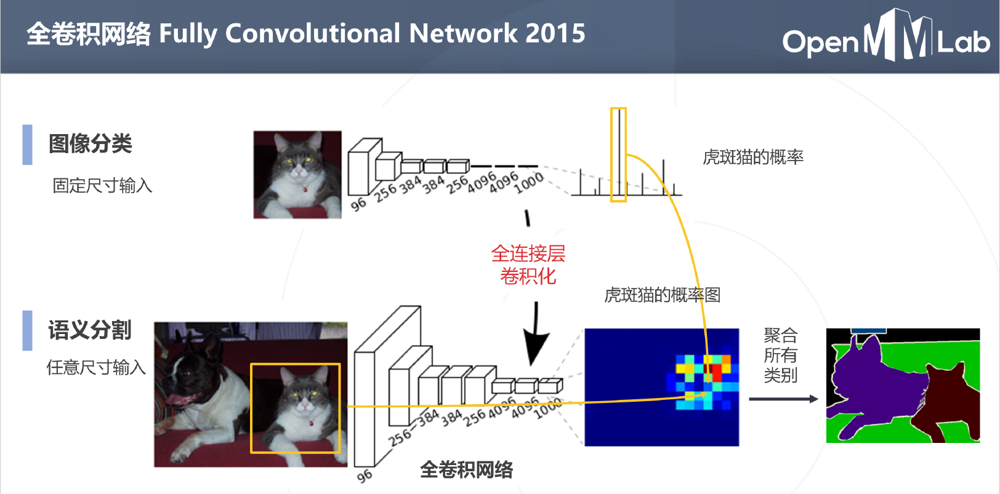

## Segmentation

- 语意分割
- 实例分割
- 全景分割：语意分割+实例分割

## 上采样

分类问题会通过降采样（步长卷积或者池化）获得高层次的语意，导致卷积网络输出小于输入尺寸

分割问题输出的尺寸最好和输入一样，所以需要上采样操作

上采样的2种方法：

- 双线性插值（Bilinear Interpolation）：从卷积的角度看，可以理解为卷积核 weight 固定的转置卷积，先把原特征图散开补充0，再进行卷积操作
- 转置卷积（Transposed Convolution）：可学习的升采样，与普通卷积不是逆运算

**基于多层级特征的上采样**：基于顶层特征图进行上采样的预测图比较粗糙，解决思路是结合低层次和高层次的特征图：

- FCN
- U-Net

