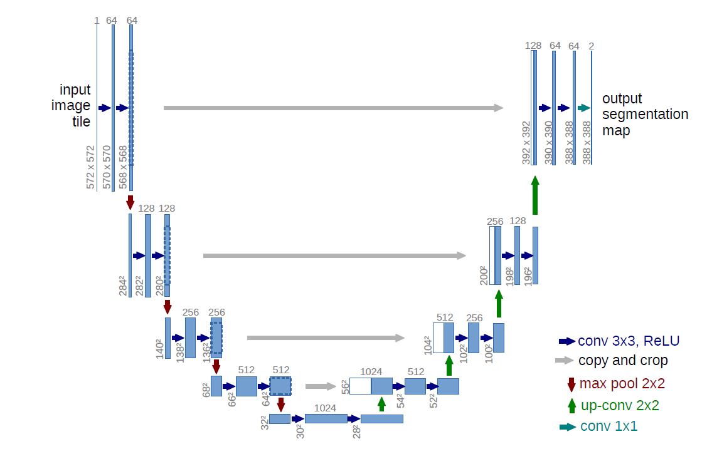
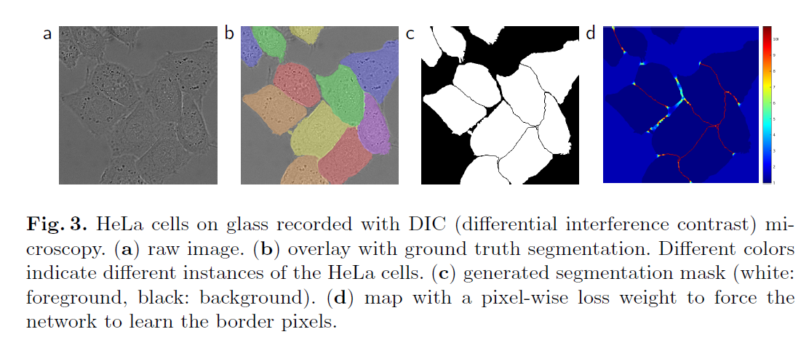

# U-Net

https://arxiv.org/abs/1505.04597 

## 模型结构

原论文中的实现如下图：

- 蓝色箭头的 Conv 不加 padding，导致最后的输出 hw 和输入不一致
- 灰色箭头会通过中心裁剪来对齐 hw
- 绿色箭头 up-conv 是转置卷积

一般情况下 蓝色箭头中可以加上 padding 保持特征图 hw 不变，并在 RELU 前加上 BN，这样灰色箭头也不需要裁剪，最终的输出 hw 和输入 hw 一致

## 其他

1. 分割大图片时可以把每次输入 大图片中的一个 patch，且相邻 patch 之间有重叠区域 overlap，不然无法利用 patch 边缘的信息

2. U-Net 的提出与医学有关，因为细胞之间的边界比较难以区分，作者在训练时在计算 loss 时给了细胞边界较大的权重（没有消融实验）

